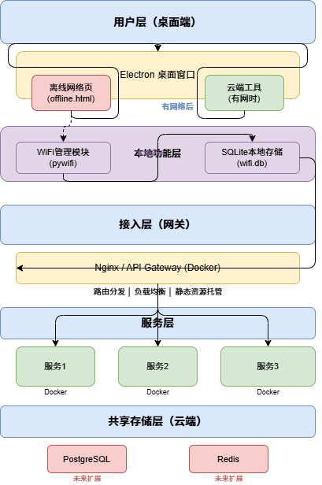
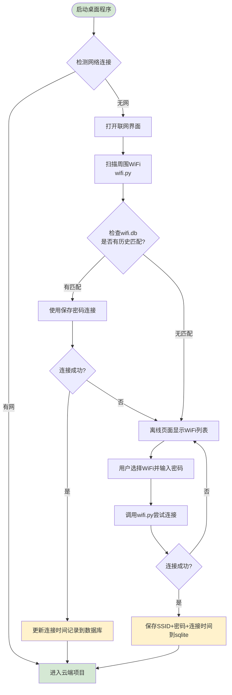
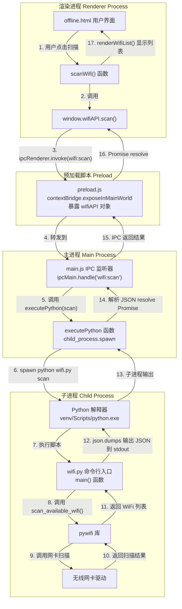
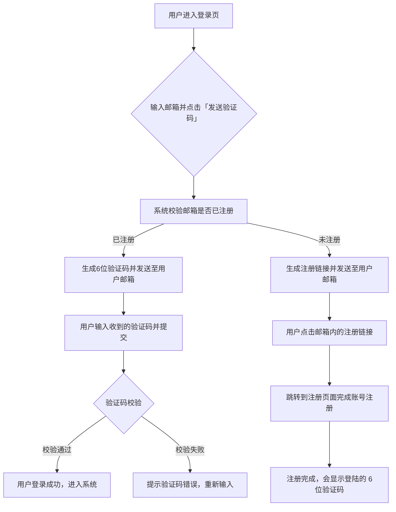

# 通用型智能工具集的设计与实现
---
## 绪论
---
### 项目背景
在日常学习、办公与开发工作中，用户经常需要处理文本统计、文件格式转换、信息提取等类似重复性任务。
当前普遍存在以下痛点：
1.  **工具分散**：功能散落在不同软件或网页，切换繁琐、效率低下。
2.  **操作繁琐**：单一功能往往需要多个步骤，缺乏一站式解决方案。
3.  **数据孤岛**：各工具之间无法无缝衔接，导致数据流转困难。
因此，本项目旨在设计并实现一套**通用型智能工具集**，通过模块化架构将各类常用工具网页信息进行统一整合。不仅能够为用户提供便捷、高效的一站式操作体验，也便于后续功能的扩展与维护，从而提升整体的工作处理效率。

---
### 项目目标
#### 功能目标：
我希望将文件处理，天气展示，个人隐私空间，IP登陆显示，接入大模型api智能体机器人，快捷链接跳转通道,ocr识别,网络管理模块等功能模块
#### 架构设计目标：
- 云计算 + 容器化，Docker + 微服务

1. **模块化与高内聚低耦合**
系统采用微服务的思想进行模块化划分，将不同的业务模块封装成独立服务，各个服务职责单一进行
2. **环境一致性与可移植性**
通过Docker容器化技术，为每一个服务提供独立统一的运行环境，消除因环境导致的兼容性问题，保证系统在本地开发与上线云服务中运行的结果一致，同时支持跨平台部署，提升系统的可移植性与运维效率
3. **可扩展与弹性伸缩处理资源能力**
依赖云服务器的云计算资源，系统支持服务的水平扩展，随着功能和用户的增长，可通过容器的实例数量增加来提升系统的并发处理能力，无需修改全局代码内容
4. **高可用性与容错性**
每个服务以独立容器运行，实现了故障隔离处理，单个服务内容的异常不会影响整个系统的运行，避免系统全崩，同时容器化部署也方便后续实现服务的快速启动与恢复，提升了系统的整体稳定性
5. **易维护与可迭代性**
各个服务之间通过接口实现通信，实现了解耦。开发与维护工作可以安装服务模块独立进行，后续添加或修改功能不会影响其他模块的正常运行，为系统长期迭代与功能扩展提供稳定性

## 桌面功能模块

### 技术选型

| 技术 | 版本 | 用途 |
|------|------|------|
| electron | 33.4.11 | 桌面窗口容器，加载本地或远程页面 |
| pywifi | 1.1.12 | WiFi扫描、连接、状态检测 |
| comtypes | 1.4.16 | Windows底层COM接口，pywifi依赖 |

#### 选型理由
- electron提供更加美观的界面同时支持多标签浏览器套壳
- pywifi 是 Python 生态中唯一能实现 WIFI 扫描与链接的库，无可替代
- comtypes 是 pywifi 在 Windows 下的必要底层依赖，负责调用系统 COM 接口

### 数据流向

- 整体结构

- 数据调用

### 本地数据存储
- 存储位置：根目录 data/wifi.db
- 存储内容：WIFI昵称，密码，连接时间
- 存储方式：SQLite 本地数据库文件
- 读取时机：每次启动自动读取，尝试扫描周围WIFI发现连接历史WIFI自动连接

### 窗口布局

有网状态：
- 全屏加载云端 Web 项目

无网状态（offline.html）：
- 加载离线显示的窗口
- 正中间框内显示wifi的内容信息
- 周围内容界面包含美化效果（开发中确定）

## 服务模块

### 技术栈

| 技术 | 版本 | 用途 |
|------|------|------|
|FastAPI|0.136.0|核心 API 框架|

#### 选型理由
- FastAPI选型理由
异步高性能、自动生成文档、类型提示完善，与 Python 生态无缝集成

### 用户认证与登录服务

#### 功能描述
- 通过邮箱验证码验证登陆
- 已注册的邮箱通过邮箱接收验证码登陆
- 未注册的邮箱在接收邮箱会收到注册链接，将本邮箱注册为本网站的用户

#### 数据流向
用户进入登录页面后，整个流程分为「已有账号登录」和「首次注册登录」两种路径：

